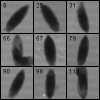

# EclosionDetector

`EclosionDetector` is a Python script for [Fiji](https://fiji.sc/) to detect eclosion events in *Drosophila melanogaster*.
The detection of eclosion events is based on the difference in brightness between a pupa and an empty pupal case. 
The latter is almost transparent while a late pupa is considerably darker.

# Usage

The script can be run from the Fiji script editor. First open the stack you want to analyze. This can be a video or an image sequence.

You can define the frame (`start_slice`) that is used to detect the pupae. The pupae should be darker than the background (i.e. below `threshold`).

You can define the minimum (`min_area`) and maximum (`max_area`) area (in pixel) for a pupae manually or estimate it with `autoset_size()`.
Here you can set the minimum (`min_area_factor`) and maximum (`max_area_factor`) in relation to the median of all detections.

You can also define the range of frames (`idx_min` and `idx_max`) where eclosion events should be detected.

The difference in brightness for an eclosion event is defined in `diff_hatch`.

`save_csv()`
The time (frame) for each eclosion event and the position of the pupa are recorded and can be exported as a csv file for further analysis.

`create_mosaik()`
The script can create a mosaik of frames just before and after the eclosion. This can be used for quality control and to exclude detections.

